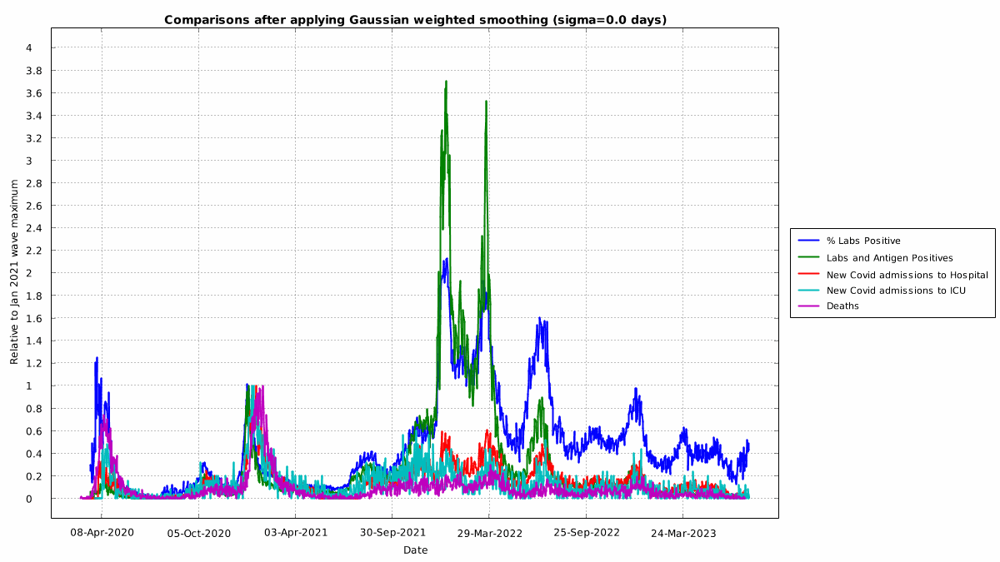
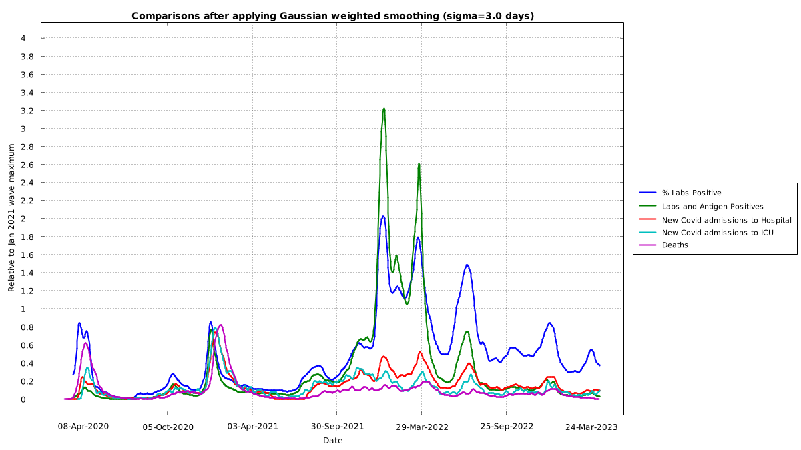
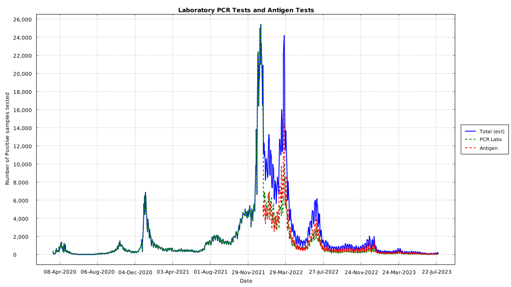
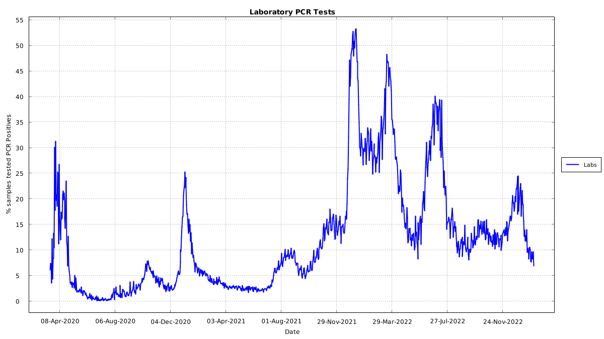
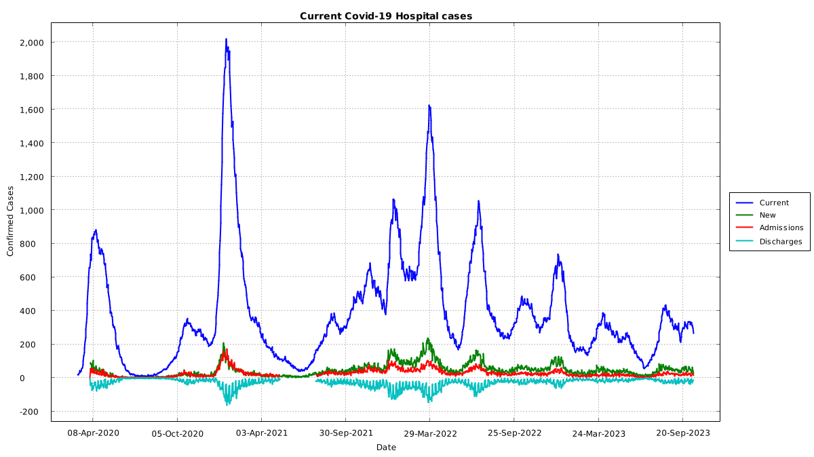
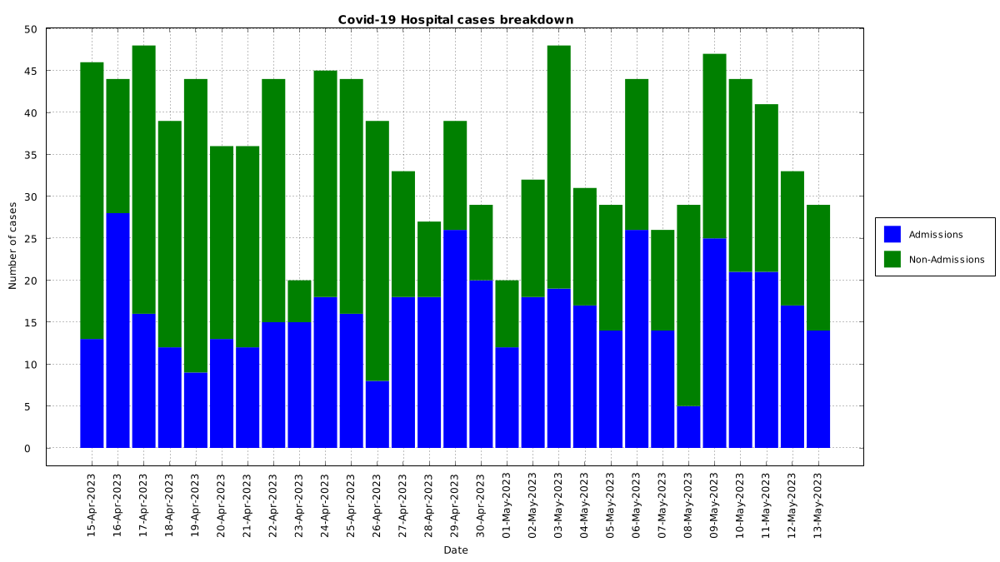
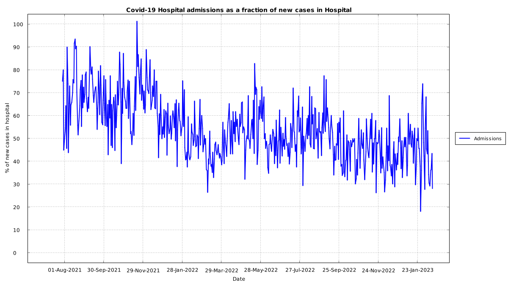
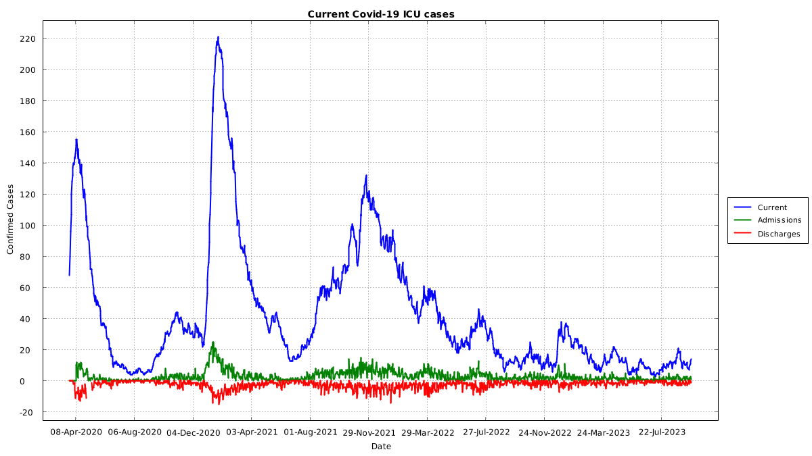
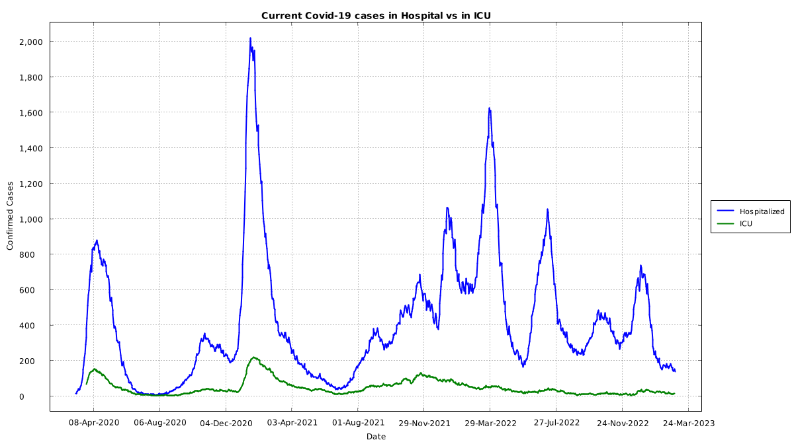
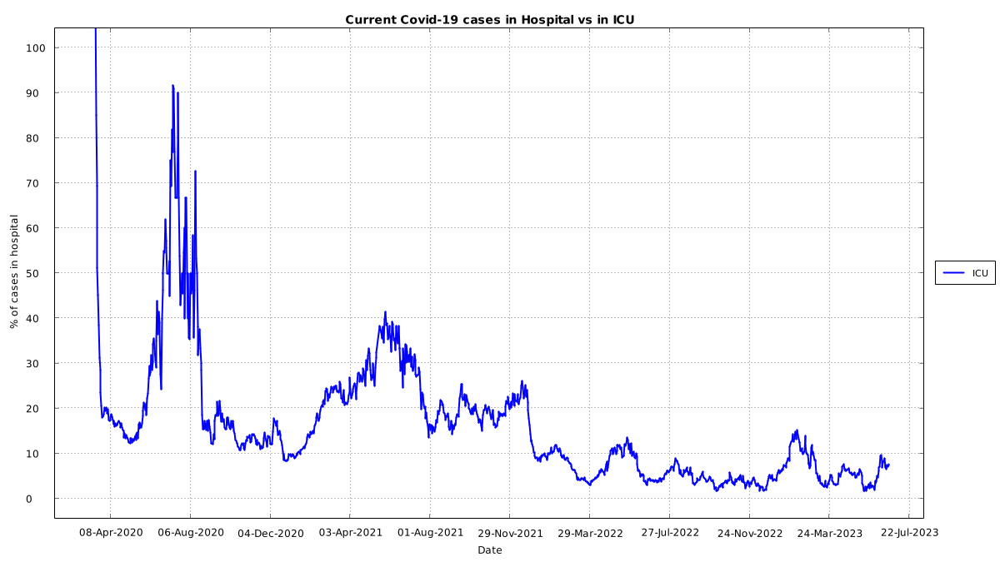

# Graphs from Irish data

These graphs are generated automatically by a GitHub action.

## Overview

NOTE: Deaths have a minimum Gaussian smoothing factor of sigma = 5 days to correct for the weekly publishing of deaths from Mid-2021 onwards

## Laboratory testing

## Hospitalizations

## ICU

